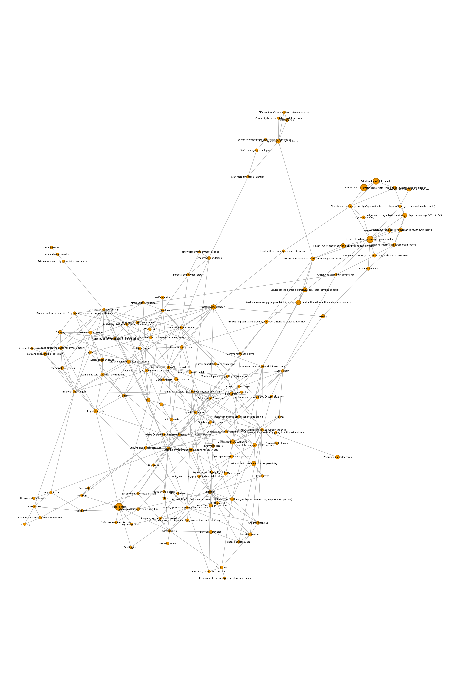

# ActEarly
This is a repository of some of the systems work on ActEarly, a 5 year research project based in Bradford and Towerhamlets. You can read more about ActEarly [here](https://actearly.org.uk/), and an interactive network is [here](https://prgarnett.github.io/ActEarly/interactive_network.html).

There are a few files included, one is the visualisation of the mapping of ActEarly projects onto the Child Health System (shown below) that was published in [Mapping ActEarly: Using a child health map to evaluate a City Collaboratory programme on early promotion of good health and wellbeing](https://journals.plos.org/plosone/article?id=10.1371/journal.pone.0326825).
In the image the network was developed from the paper [A systems map of the determinants of child health inequalities in England at the local level](https://journals.plos.org/plosone/article?id=10.1371/journal.pone.0245577), and the size of the nodes shows the number ActEarly projects that map to that part of the child health system. An interactive version of this visualisation is availble here (coming soon).

## Ripple Effects Mapping
We also did some work tracking the ripple effects of aspect of the ActEarly project. An image of the full map is below, and there is a reasonable version of an interactive map available [here](https://prgarnett.github.io/ActEarly/ripple_effects_map.html).

